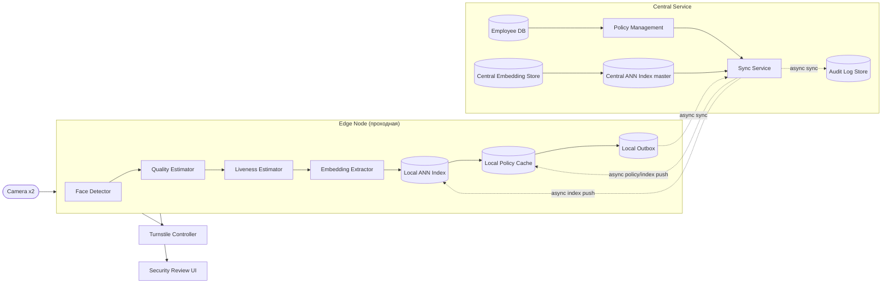
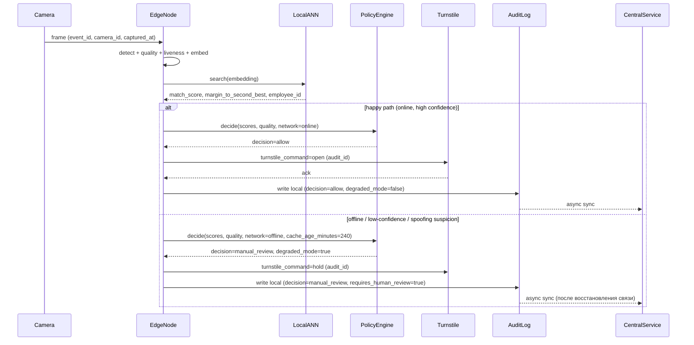

# Architecture

## Компоненты

- **Camera** — 2 шт. на проходной, поток кадров в Edge Node.
- **Edge Node** (GPU, на проходной): Face Detector (SCRFD), Quality Estimator (FIQA-прокси), Liveness Estimator (Silent-Face-Anti-Spoofing), Embedding Extractor (ArcFace/InsightFace buffalo_l, 512-D), Local ANN Index (FAISS HNSW, реплика галереи), Local Policy Cache (пороги, access policy, revocation-лист), Local Outbox (буфер решений/audit-записей до синхронизации с центром).
- **Central Service**: Employee DB (мастер метаданных сотрудников и access policy), Central Embedding Store (источник истины по эмбеддингам), Central ANN Index master (пересборка/версионирование индекса), Policy Management (управление порогами T_high/T_low/M), Audit Log Store, Sync Service (доставка индекса/policy на edge, приём outbox с edge).
- **Turnstile Controller** — исполняет команду `open`/`hold`, подтверждает исполнение.
- **Security Review UI** — интерфейс охраны для разбора `manual_review`.

## Data flow (happy path)

1. Camera → Edge Node: кадр с `camera_id`, формируется `event_id`, `captured_at`, `frame_uri` (локальный, temp).
2. Face Detector находит лицо → `quality.face_detected=true`.
3. Quality Estimator и Liveness Estimator считают `quality.quality_score`, `quality.liveness_score`.
4. Embedding Extractor строит 512-D эмбеддинг из кадра.
5. Local ANN Index ищет ближайших кандидатов → `match_score`, `margin_to_second_best`, кандидат `employee_id`.
6. Policy Engine применяет three-way decision → `decision=allow`.
7. Turnstile Controller получает `turnstile_command=open` с idempotency-ключом `audit_id`.
8. Local Outbox пишет audit-запись (`decision_id`, `decision`, скоры, `reasons=[]`, `degraded_mode=false`, `latency_ms`) в локальную транзакцию вместе с решением.
9. Асинхронно запись синхронизируется в Central Audit Log Store.

## Edge vs central: что и почему

- Весь hot path (детекция → liveness → эмбеддинг → ANN-поиск → policy decision) выполняется **на edge**: единственный способ уложиться в **p95 ≤ 1с** — не гонять кадр или запрос в центр и обратно по сети на каждый проход.
- В центр с edge уходит **только эмбеддинг**, не сырой кадр: экономит latency и снижает объём биометрических данных, покидающих периметр проходной (приватность).
- Локальная реплика ANN-индекса на edge обязательна: галерея — это весь штат кампуса (сотни тысяч), а не только сотрудники одной проходной, и sub-second поиск по такой базе через сеть до центра недостижим при требуемом p95, к тому же не переживёт обрыв связи.
- Central Service — источник истины (Employee DB, master-индекс), edge — исполнитель с локальной репликой: это даёт отказоустойчивость (см. ниже) ценой eventual consistency между central и edge.

## Синхронный hot path vs асинхронные части

**Синхронно** (в рамках одного `verify`-запроса, укладывается в p95 ≤ 1с): detect → quality → liveness → embed → ANN search (local) → policy decision → turnstile command → local audit write (outbox).

**Асинхронно**: sync индекса/policy/revocation-листа с центра на edge; sync audit log из edge outbox в центр; offline-пересчёт порогов и переобучение/дообучение моделей; аналитика и мониторинг (drift, метрики, алерты).

## Хранилища

| Хранилище | Где | Формат | Retention |
|---|---|---|---|
| Employee DB | central, реплика (метаданные + access policy) на edge | реляционная БД | пока сотрудник активен + N дней после увольнения |
| Embedding store | central источник истины + Local ANN Index (edge) | векторный индекс (FAISS HNSW), эмбеддинги не в открытом виде | пока сотрудник активен |
| Audit Log | event-sourced, локально на edge (Local Outbox) → sync в Central Audit Log Store | append-only лог, `decision, scores, reasons, model_version, threshold_version, degraded_mode` | по требованиям audit/compliance, детали — в risks-and-ops.md |

Сырые кадры (`frame_uri`) в постоянное хранилище не попадают вне edge-буфера — детали privacy см. `docs/risks-and-ops.md`.

## Интеграция с турникетом

Edge Node отправляет Turnstile Controller команду `turnstile_command` (`open`/`hold`) с idempotency-ключом = `audit_id`. Если подтверждение открытия не пришло за timeout — retry с тем же `audit_id`: контроллер обязан игнорировать повторную команду с уже исполненным `audit_id`, чтобы не открыть турникет дважды на один проход. Отсутствие подтверждения после исчерпания ретраев — событие в audit log.

## Интерфейс ручной проверки охраны

При `decision=manual_review` (`requires_human_review=true`) охрана в Security Review UI видит: кадр (`frame_uri`), `reasons[]`, `match_score`, `margin_to_second_best`, топ кандидатов из ANN-поиска, `degraded_mode`. Охрана принимает решение: пропустить вручную (ручной `open` турникета) или отказать. Решение охраны пишется в audit log как отдельная запись, привязанная к исходному `decision_id`, с указанием оператора.

## Fallback-пути при сбоях

| # | Событие | `decision` | `degraded_mode` | `requires_human_review` | Что происходит |
|---|---|---|---|---|---|
| 1 | Типовой проход, online, нормальное освещение | `allow` | `false` | `false` | Полный happy path, турникет открывается автоматически |
| 2 | Плохое качество кадра (маска, контровый свет) | `manual_review` (или `deny` при полном провале детекции) | `false` | `true` | `quality_score` ниже порога → policy engine не допускает `allow`, `reasons` содержит причину low quality |
| 3 | Spoofing (фото с экрана) | `deny` / `manual_review` | `false` | зависит от порога liveness | `liveness_score` ниже порога → турникет не открывается независимо от `match_score` |
| 4 | Low-confidence: малый `margin_to_second_best` | `manual_review` | `false` | `true` | Two-way tie между кандидатами — policy engine не рискует автооткрытием |
| 5 | Offline, `network=offline`, `cache_age_minutes=240`, возможен неактуальный revocation-лист | `manual_review` | `true` | `true` | Устаревший локальный кэш не даёт гарантии, что доступ не отозван — система не открывает турникет автоматически, эскалирует к охране |

## Диаграммы (Mermaid)

### Компонентная диаграмма

### Sequence-диаграмма: happy path и offline/risky ветка

## Trade-off'ы

- **Локальная реплика ANN-индекса на edge vs свежесть данных**: выигрываем в задержке и офлайн-устойчивости, но платим eventual consistency — revocation сотрудника может не успеть доехать до edge за окно `cache_age_minutes`. Компенсируется тем, что устаревший офлайн-кэш переводит систему в `degraded_mode` и manual_review, а не в автооткрытие.
- **Только эмбеддинг в центр, не кадр**: выигрываем в приватности и трафике, но теряем возможность централизованного постфактум-разбора по сырому кадру за пределами edge-буфера.
- **Консервативный three-way decision вместо одного порога**: жертвуем частью автоматизации (больше случаев уходит в manual_review, больше нагрузки на охрану, чем при агрессивном пороге), ради асимметрии цены ошибок — false accept дороже false reject.
